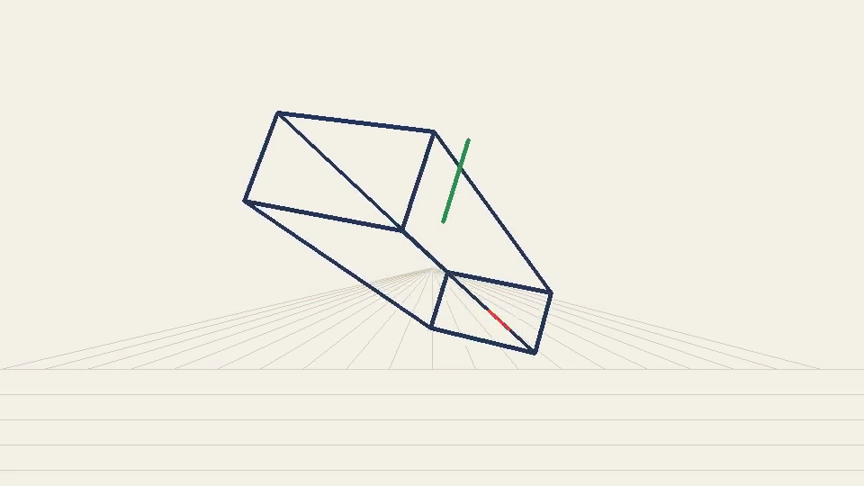
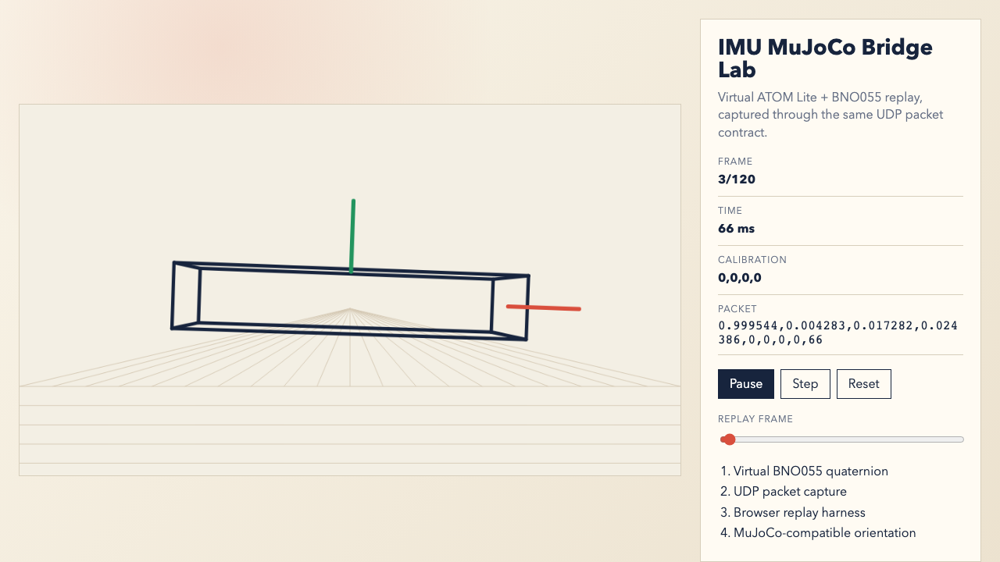

# imu-mujoco-bridge

Stream BNO055 absolute-orientation quaternions into a MuJoCo model.

[](docs/demo.mp4)

[Watch the simulated demo video](docs/demo.mp4)

This repeats the useful part of the referenced demo: an M5 ATOM Lite reads a
BNO055 IMU, sends quaternion packets over UDP, and a PC uses those packets to
rotate a MuJoCo body in real time.

The same receiver path can run from three sources:

- `imu-virtual-device`: simulated ATOM Lite plus BNO055, over real UDP.
- `firmware/`: real ATOM Lite plus BNO055, over real UDP.
- `imu-camera-marker`: webcam ArUco marker pose, converted to the same quaternion UDP packets.

## Why

For all-direction orientation, use quaternions from a 9-axis absolute-orientation
sensor. The BNO055 handles fusion on-chip and outputs quaternion samples at up to
100 Hz, which is a good fit for a small wireless pose controller.

## Hardware

- M5Stack ATOM Lite or compatible ESP32 board.
- Adafruit BNO055 breakout or compatible BNO055 module.
- I2C wiring from ESP32 to BNO055.
- Same Wi-Fi network as the computer running the viewer.

## Packet Contract

UDP port defaults to `5005`.

CSV:

```text
qw,qx,qy,qz,cal_sys,cal_gyro,cal_accel,cal_mag,t_ms
```

Minimal CSV is also accepted:

```text
qw,qx,qy,qz
```

JSON is accepted too:

```json
{"qw":1,"qx":0,"qy":0,"qz":0,"t_ms":123,"calibration":[3,3,3,3]}
```

Quaternion order is `w,x,y,z`, matching MuJoCo free-joint orientation order.

## Quick Start Without Hardware

```sh
python3 -m venv .venv
. .venv/bin/activate
python -m pip install -e .
python -m imu_mujoco_bridge.demo --packets 3
PYTHONPATH=src python -m unittest discover -s tests
```

Run the browser lab:

```sh
python -m imu_mujoco_bridge.export_replay --output web/replay.js
npm install
npm run serve
```

Open `http://127.0.0.1:4173/web/lab.html`.

Run the no-hardware end-to-end gate:

```sh
npm run test:e2e
```

Or run the full synthetic gate:

```sh
scripts/verify
```

Render the hardware-free imitation video:

```sh
imu-flow-demo --output docs/demo.mp4 --poster docs/demo-poster.png
```

This command uses `ffmpeg`.

Optional MuJoCo viewer:

```sh
python -m pip install -e '.[mujoco]'
imu-mujoco-viewer --simulate
```

## Closer-To-Reality Simulation

For a full flow imitation without hardware, run a virtual device that behaves
like the original X setup:

```sh
imu-virtual-device --host 127.0.0.1 --port 5005 --rate-hz 60
```

In another terminal:

```sh
imu-udp-dump --host 127.0.0.1 --port 5005
```

The virtual device simulates:

- BNO055 quaternion packets.
- Calibration ramp from `0,0,0,0` to `3,3,3,3`.
- Optional quaternion noise with `--noise`.
- Optional packet loss with `--drop-rate`.
- Optional Wi-Fi timing jitter with `--jitter-ms`.

To regenerate the README video from the actual UDP sender/receiver path:

```sh
imu-flow-demo --output docs/demo.mp4 --poster docs/demo-poster.png
```

## Browser Lab

The browser lab is the CI-friendly proof environment. It uses a replay fixture
generated from the virtual ATOM/BNO055 UDP loopback and verifies the visual path
with Playwright.



```sh
imu-export-replay --output web/replay.js
npm run test:e2e
```

Playwright checks:

- lab page loads on desktop and mobile viewports;
- telemetry shows captured CSV packets;
- the canvas is nonblank;
- pause, step, reset, and scrub controls work;
- calibration starts at `0,0,0,0`.

See `docs/SYNTHETIC_TEST_PLAN.md` for the no-hardware readiness matrix.

## Camera Marker Mode

Camera mode is useful when you want an IRL demo without IMU hardware. Print or
display an ArUco marker, point a webcam at it, and the marker pose is converted
to the same quaternion UDP stream.

Install optional camera support:

```sh
python -m pip install -e '.[camera]'
```

Generate a marker:

```sh
imu-camera-marker --make-marker docs/aruco-4x4-id0.png --marker-id 0
```

Stream marker pose:

```sh
imu-camera-marker --host 127.0.0.1 --port 5005 --marker-id 0 --show
```

Then run the same receiver:

```sh
imu-mujoco-viewer --port 5005
```

Camera mode uses approximate camera intrinsics by default. For measurement-grade
pose, calibrate the webcam and pass a real focal length with `--focal-px`.

## Run With Hardware

1. Copy firmware config:

```sh
cp firmware/include/config.example.h firmware/include/config.h
```

2. Edit `firmware/include/config.h` with Wi-Fi and the PC IP address.
3. Flash with PlatformIO:

```sh
pio run -d firmware -t upload
```

4. On the PC:

```sh
imu-udp-dump --port 5005
imu-mujoco-viewer --port 5005
```

## Notes

- Keep the BNO055 away from magnets and high-current wiring while testing yaw.
- Watch calibration values. `3,3,3,3` is ideal; lower magnetometer calibration can show up as yaw instability.
- Prefer quaternion packets over Euler angles for full-range orientation.

## License

MIT
